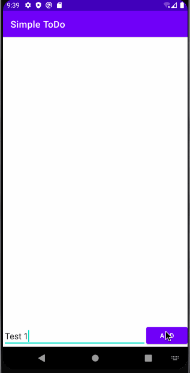

# Project 1 - *Simple ToDo App*

Simple ToDo is an android app that allows building a todo list and basic todo items management functionality including adding new items, editing and deleting an existing item.

Submitted by: **Erik Briganty**

Time spent: **6** hours spent in total

## User Stories

The following **required** functionality is completed:

* [x] User can **view a list of todo items**
* [x] User can **successfully add and remove items** from the todo list
* [x] User's **list of items persisted** upon modification and and retrieved properly on app restart

The following **optional** features are implemented:

* [x] User can **tap a todo item in the list and bring up an edit screen for the todo item** and then have any changes to the text reflected in the todo list

The following **additional** features are implemented:

* [x] Stay Tuned!

## Video Walkthrough

Here's a walkthrough of the app:

GIF created with [LiceCap](http://www.cockos.com/licecap/).

## Notes

This is my first time building an application using Java and Android Studio. I'm still fairly new with the language and there is a bit of a learning curve, but I have learned a lot while completing this project. I hope to roll out updates as I get more comfortable and knowledgeable with Java and Android development.

## License

    Copyright [2021] [Erik Briganty]

    Licensed under the Apache License, Version 2.0 (the "License");
    you may not use this file except in compliance with the License.
    You may obtain a copy of the License at

        http://www.apache.org/licenses/LICENSE-2.0

    Unless required by applicable law or agreed to in writing, software
    distributed under the License is distributed on an "AS IS" BASIS,
    WITHOUT WARRANTIES OR CONDITIONS OF ANY KIND, either express or implied.
    See the License for the specific language governing permissions and
    limitations under the License.
{"mode":"full","isActive":false}
